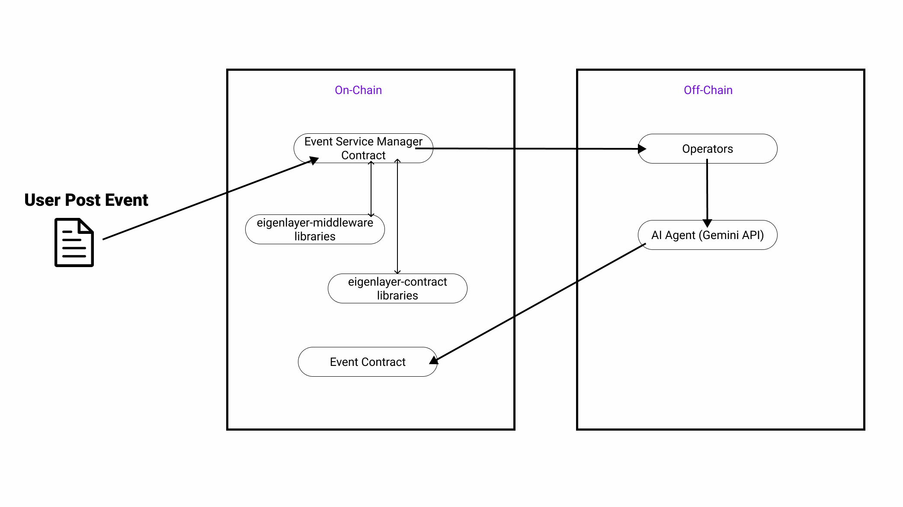

# Location Verifier AVS
AVS that verify whether the event location is real before it gets put on-chain

## Architecture

### AVS User Flow

1) AVS consumer requests an event data to be generated and signed.
2) Event contract receives the request and emits a NewTaskCreated event for the request.
3) All Operators who are registered to the AVS and has staked, delegated assets takes this request. Operator generates the requested message, hashes it, and signs the hash with their private key.
4) Each Operator uses Gemini API verify whether the event location is real and submits the result and signed hash back to the Event AVS contract.
5) If the event location is real, it get added on-chain.